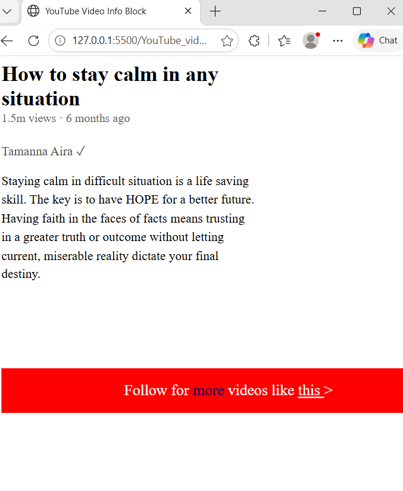
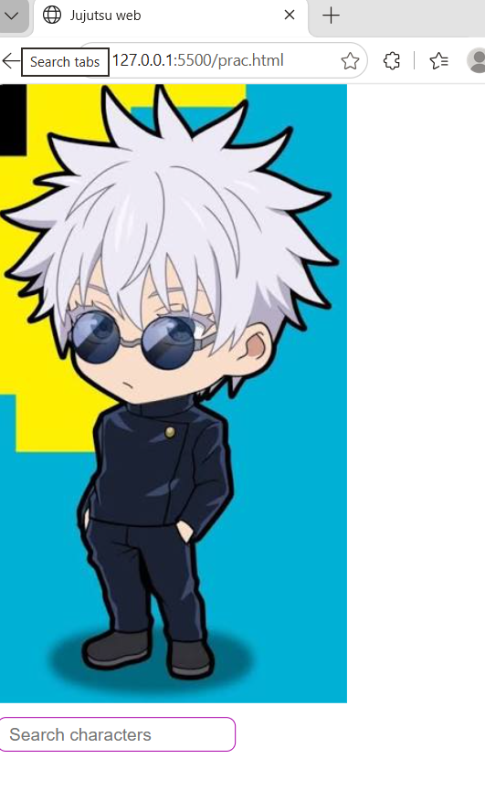

# HTML & CSS Practice

This repository contains my ongoing HTML and CSS practice projects as I build a strong foundation in frontend development.

I use these mini-projects to practice concepts from lessons, rebuild ideas independently, experiment with styling, and improve my debugging and UI-building skills.

---

## Projects

### 1. Perfume Product Card

A simple product card built to practice CSS styling and interactive button states.

#### Concepts Practiced
- CSS classes
- Padding
- Borders
- Border radius
- Box shadows
- Width and sizing
- Hover states
- Active states
- Transitions
- CSS transforms
- Button styling

#### Preview

---

### 2. YouTube Video Info Block

A YouTube-inspired video information section built to practice HTML structure and text styling.

#### Features
- Video title
- View count and upload date
- Author information
- Video description
- Promotional banner
- Interactive text hover effect

#### Concepts Practiced
- HTML document structure
- Paragraph styling
- CSS classes
- Font size and weight
- Text colors
- Margins and padding
- Width
- Line height
- `` elements
- Hover effects
- `cursor: pointer`
- HTML entities

#### Preview

---

## Technologies

- HTML5
- CSS3

---

## Learning Goals

Through this repository, I am working on:

- Writing clean HTML structure
- Understanding the CSS box model
- Styling reusable UI components
- Improving spacing and typography
- Creating hover and active interactions
- Using transitions and transforms
- Debugging HTML and CSS issues
- Building small interfaces independently instead of only copying tutorials

### 3. Image + Search Box

A small HTML and CSS practice project built to practice working with images and text input fields.

#### Features
- Character image
- Search input
- Placeholder text
- Rounded search box
- Custom border styling
- Spacing between elements

#### Concepts Practiced
- `` elements
- `<input>` elements
- `placeholder`
- CSS width
- Padding
- Borders
- Border radius
- Margins
- Basic layout behavior

#### Preview

---

## Current Status

🚧 **Actively learning and updating**

More HTML and CSS practice projects will be added as I continue learning layout, Flexbox, Grid, responsive design, and more advanced frontend concepts.

