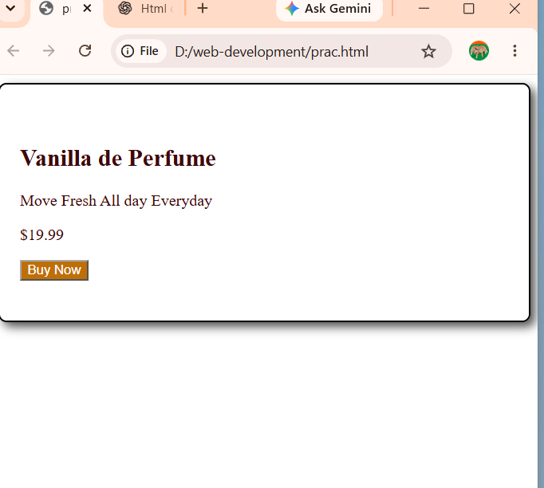

# HTML CSS Practice

A small practice repository for learning HTML and CSS.

## Project

### Perfume Product Card

Built with:
- HTML
- CSS

Practiced:
- Padding
- Borders
- Border radius
- Box shadow
- Hover states
- Active states
- Transitions
- Transform
- CSS classes

## Preview

# YouTube Video Info Block

A small HTML and CSS practice project inspired by YouTube-style video information sections.

This project was built to practice basic HTML structure, text styling, spacing, hover effects, and reusable CSS classes.

## Preview

I will add a screenshot of the finished project here.

## Features

- Styled video title
- Video views and upload date
- Author information
- Video description section
- Promotional banner
- Hover effect on interactive text
- Custom font sizes, colors, spacing, and line height

## Technologies Used

- HTML5
- CSS3

## What I Practiced

While building this project, I practiced:

- HTML document structure
- Paragraph and text styling
- CSS classes
- Font styling
- Margins and padding
- Width and line-height
- Text colors
- `` elements
- Hover effects
- `cursor: pointer`
- HTML entities

